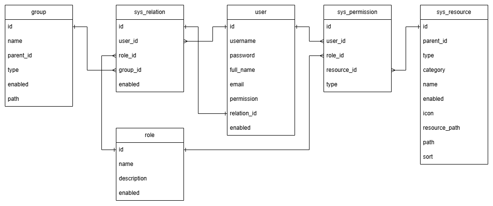

# Contents
- [Setup](#setup)


# Setup
1. Update `application.properties`
   
> Application name
> ```properties
> spring.application.name=<your app name>
> ```
> Database connection
> ```properties
> spring.datasource.url=jdbc:mysql://<ip>:<port>/<default_schema>?autoReconnect=true&useUnicode=true&characterEncoding=utf-8&zeroDateTimeBehavior=round&useSSL=true
> spring.datasource.username=
> spring.datasource.password=
> ```
> Auto create/update base tables - On initial run, keep this `true`. After base tables are created you can set this to `false`.
> ```properties
> template.app.autoUpdateTables=true
> ```


# Database Structure


## user

Essential information about each user, including their username, password, full name, and email address. It serves as the primary table for user authentication and identification.

| Column      | Description                                                                                                 | 
|-------------|-------------------------------------------------------------------------------------------------------------|
| id          | Primary key                                                                                                 |
| username    | Unique, used for login                                                                                      |
| password    | Encrypted, used for login                                                                                   |
| full_name   | Full name                                                                                                   |
| email       | Email Address                                                                                               |
| permission  | Values:<br/>ROLE = Uses role specific resource permission<br/>USER = Uses user specific resource permission |
| relation_id | Foreign key to sys_relation.id. This is the current role & group of the user                                |
| enabled     | Values:<br/>1 = Enabled<br/>0 = Disabled                                                                    | 

## role

Defines various user roles within the system. These roles help manage user permissions and access control.

| Column      | Description                                      |
|-------------|--------------------------------------------------|
| id          | Primary key                                      |
| name        | Name of the role                                 |
| description | (Optional) Brief description about the role      |
| enabled     | Values:<br/>1 = Enabled<br/>0 = Disabled         |

## group

Contains the organizational structure of the system. It is used to group users based on hierarchical or functional divisions within the system.

| Column    | Description                                                                                                                                      |
|-----------|--------------------------------------------------------------------------------------------------------------------------------------------------|
| id        | Primary key                                                                                                                                      |
| name      | Name of the group                                                                                                                                |
| parent_id | Foreign key relates to the id of this table. If null it means the group is top-level                                                             |
| type      | 1 = Top-level<br/>2 = 2nd level<br/>...and so on                                                                                                 |
| enabled   | Values:<br/>1 = Enabled<br/>0 = Disabled                                                                                                         |
| path      | The group's hierarchy in the format of concatenated ids. <br/>Example value: `1.2` which means the group's id is `2` where it's parent id is `1` |

## sys_relation

Relation between the `user`, `role`, and `group`.

| Column   | Description                              |
|----------|------------------------------------------|
| id       | Primary key                              |
| user_id  | Foreign key to `user.id`                 |
| role_id  | Foreign key to `role.id`                 |
| group_id | Foreign key to `group.id`                |
| enabled  | Values:<br/>1 = Enabled<br/>0 = Disabled |

## sys_resource

Defines modules within the system, menus and buttons are stored here that can be toggled 

| Column        | Description                                                                                                                                                                        |
|---------------|------------------------------------------------------------------------------------------------------------------------------------------------------------------------------------|
| id            | Primary key                                                                                                                                                                        | 
| parent_id     | Foreign key relates to the id of this table. If null it means the group is top-level                                                                                               |
| type          | 1 = Top-level<br/>2 = 2nd level<br/>...and so on                                                                                                                                   |
| category      | Values:<br/>MENU = The resource is a menu<br/>BUTTON = A functional resource like the 'Add' or 'Export' buttons                                                                    |
| icon          | (Optional) Icon that will show beside the resource (For `MENU` resources only)                                                                                                     |
| resource_path | Path of the page in the frontend project (For `MENU` resources only)                                                                                                               |
| path          | The resource's hierarchy in the format of concatenated ids. <br/>Example value: `1.2` which means the resource's id is `2` where it's parent id is `1` (For `MENU` resources only) |
| sort          | (Optional) Number indicating the order of the resource (For `MENU` resources only)                                                                                                 |

## sys_permission

User/Role related resource permissions

| Column      | Description                                                                                     |
|-------------|-------------------------------------------------------------------------------------------------|
| id          | Primary key                                                                                     |
| user_id     | Foreign key to `user.id`. <br/>Note: `user_id` and `role_id` cannot have value at the same time |
| role_id     | Foreign key to `role.id`. <br/>Note:`role_id` and `user_id` cannot have value at the same time  |
| resource_id | Foreign key to `sys_resource.id`                                                                |
| type        | Values:<br/>1 = Role based permission<br/>2 = User specific permission                          |


